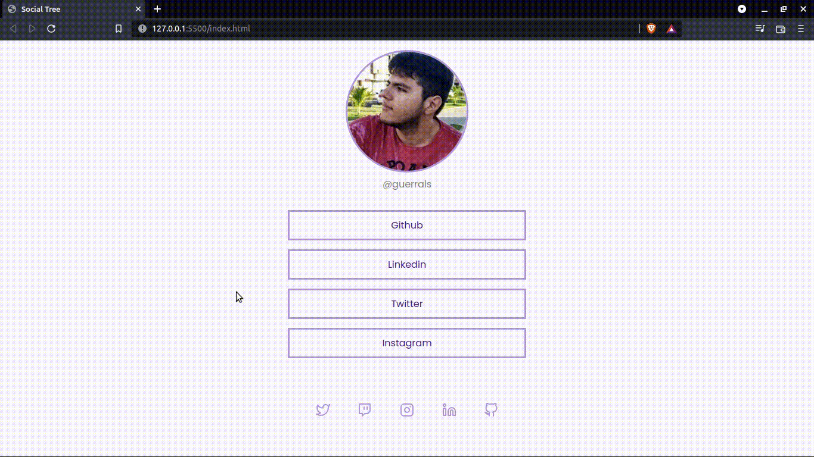

# Social Tree

Projeto inspirado dos desafios da aba de discover na `Rocketseat`.

Desenvolvido com `HTML` e `CSS` visando testar habilidades de alinhamento de componentes, organização de div, utilização semântica das tags e aplicar efeitos `CSS` de transição suave.

